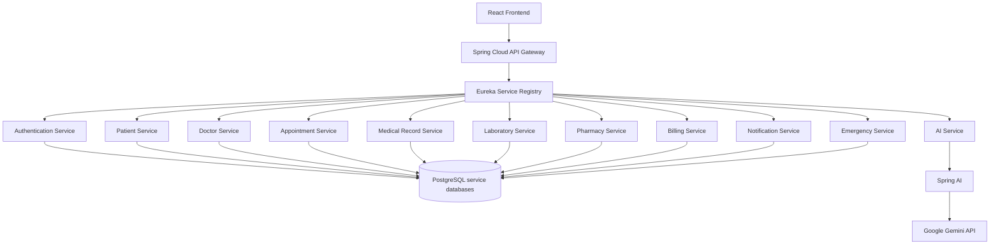

# MedFlow AI

## An Agentic Cloud-Native Healthcare Intelligence Platform using Microservices, DevOps and DevSecOps

## Academic Information

| Field | Details |
|---|---|
| Institution | KLH |
| Subject | Adaptive Software Engineering (ASE) |
| Branch | CSE |
| Academic Year | 2026-2027 |
| Team ID | 2420030474 |
| Required repository name | `KLH-CSE-2026-2027-2420030474-MedFlowAI` |
| Supervisor | To Be Confirmed |

### Team Members

| Name | University ID |
|---|---:|
| Doma Akshaya | 2420030474 |
| Jithyasri Sammeta | 2420030586 |
| Nallapu Sreeja | 2420030267 |

## Abstract

Healthcare organizations increasingly rely on digital systems to manage patients, clinicians, appointments, 
medical records, laboratory services, pharmacy operations, billing, and emergency care, yet many 
conventional healthcare management applications remain fragmented and process-centric, requiring extensive 
manual coordination across departments while providing limited intelligent support, resulting in duplicated 
information, delayed communication, inefficient appointment and queue management, difficulty interpreting 
medical documents, fragmented patient records, and slower responses to operational and emergency needs.
MedFlow AI addresses these challenges through a service-oriented microservices architecture integrated with 
artificial intelligence and modern software engineering practices, providing role-based workflows for patients, 
doctors, nurses, receptionists, laboratory staff, pharmacists, billing personnel, emergency staff, and 
administrators, with core capabilities including authentication, patient profiles and medical histories, 
appointment management, queue handling, medical records, laboratory reports, prescriptions, pharmacy 
operations, billing, notifications, and emergency support. An AI service built using Spring AI and the Google 
Gemini API coordinates six specialized agents—Patient Assistant, Doctor Assistant, Emergency Assistant, 
Pharmacy Assistant, Billing Assistant, and Hospital Operations Assistant—capable of multi-step reasoning 
and domain-specific tool use rather than single-shot question answering, supporting medical-report 
summarization, clinical information organization, appointment and queue guidance, medication and inventory 
insights, bill explanations, and operational recommendations, while functioning strictly as decision-support 
tools under human oversight rather than autonomous diagnostic or treatment systems. The system is 
implemented using Java 21, Spring Boot, Spring Cloud, React.js, and PostgreSQL with a database-perservice architecture, while Spring Security/JWT, API Gateway, Eureka, and OpenFeign provide security, 
service discovery, API routing, and inter-service communication. Docker, Kubernetes, and AWS support 
cloud-native deployment, while Jira, GitHub Actions, SonarQube, Trivy, OWASP ZAP, Prometheus, and 
Grafana enable Agile development, CI/CD, DevSecOps practices, security and code-quality validation, and 
system monitoring, collectively providing a scalable, secure, reliable, and extensible healthcare platform that 
demonstrates the integration of agentic AI with modern cloud-native software engineering.

## Problem Statement

Healthcare processes often operate through disconnected applications and manual handoffs. Important challenges include:

- Fragmented patient and clinical information
- Manual coordination among reception, doctors, laboratory, pharmacy, billing, and emergency teams
- Appointment, queue, and resource inefficiency
- Difficulty interpreting medical and billing documents
- Delayed notifications and follow-up
- Emergency workflow delays
- Limited context-aware assistance
- Weak visibility into service health, security, and delivery quality

A simple CRUD application does not solve these coordination, intelligence, scalability, and accountability problems.

## Proposed Solution

MedFlow AI is designed as a secure microservices platform with a React experience layer, API Gateway, service discovery, independently deployable healthcare services, service-owned PostgreSQL persistence, and a governed AI Service. Specialized agents will retrieve authorized information through backend tools, perform bounded multi-step workflows, and return explainable drafts or recommendations for human review.

## Objectives

1. Integrate core healthcare workflows through explicit service boundaries.
2. Provide secure, role-specific access using JWT and RBAC.
3. Demonstrate specialized agentic AI rather than a generic chatbot.
4. Improve appointment, queue, emergency, pharmacy, billing, and operational insight.
5. Apply Agile Scrum and Jira-to-deployment traceability.
6. Automate build, testing, quality, and security checks through CI/CD.
7. Demonstrate containerization, orchestration, observability, and cloud readiness.
8. Use synthetic healthcare data and protect all credentials.

## Users and Roles

Patient, Doctor, Nurse, Receptionist, Laboratory Staff, Pharmacist, Billing Staff, Emergency Staff, and Administrator. Access will follow least privilege; no role receives unrestricted access to all healthcare information.

## Planned Healthcare Capabilities

- Authentication, login, JWT, password security, and RBAC
- Patient profile, history, appointments, prescriptions, reports, bills, and notifications
- Doctor dashboard, patient review, appointments, notes, prescriptions, and laboratory reports
- Availability, booking, cancellation, rescheduling, and queue management
- Medical histories, reports, prescriptions, and clinical notes
- Laboratory requests, status, report entry/upload, and doctor access
- Pharmacy verification, inventory, stock alerts, and dispensing
- Billing, invoices, payment status, bill viewing, and explanation
- Emergency requests, priority support, alerts, and workflow tracking
- Administration, role management, service monitoring, and operational overview
- Appointment, emergency, pharmacy, and system notifications

## Planned AI Agents

1. **Patient Assistant:** hospital-service guidance, appointment help, and queue assistance.
2. **Doctor Assistant:** authorized record and laboratory-report summaries for doctor review.
3. **Emergency Assistant:** structured intake, configured priority-rule support, and staff notification.
4. **Pharmacy Assistant:** medication information, prescription support, and inventory insights.
5. **Billing Assistant:** invoice and bill-component explanations.
6. **Hospital Operations Assistant:** queue, appointment, resource, and operational summaries.

These agents are planned components. AI will not independently diagnose, prescribe medication, or approve sensitive clinical or financial actions.

## Planned Technology Stack

| Area | Technologies |
|---|---|
| Backend | Java 21, Spring Boot, Spring Cloud, Maven |
| Frontend | React.js, JavaScript, Axios, React Router, modern UI framework |
| Database | PostgreSQL, Spring Data JPA, Hibernate |
| SOA/Microservices | Spring Cloud Gateway, Eureka, OpenFeign, REST APIs |
| Security | Spring Security, JWT, RBAC |
| AI | Spring AI, Google Gemini API |
| DevOps | Git, GitHub, GitHub Actions, Docker, Docker Compose, Kubernetes, Minikube |
| DevSecOps | SonarQube, Trivy, OWASP ZAP |
| Monitoring | Spring Boot Actuator, Prometheus, Grafana |
| Testing/API | JUnit, Mockito, Spring Boot Tests, Postman, Swagger/OpenAPI |
| Management | Jira, Agile Scrum |
| Cloud | AWS where practical |

## High-Level Architecture



The frontend never communicates directly with Gemini. The architecture will be refined through implementation evidence and architecture decision records.

## Adaptive Software Engineering and Scrum

Jira will manage epics, stories, tasks, bugs, acceptance criteria, estimates, sprints, and progress. Sprint planning will select a measurable goal; daily coordination will expose blockers; reviews will demonstrate actual increments; retrospectives will create owned improvements. The backlog will adapt to stakeholder feedback, security findings, tests, and operational evidence.

Required traceability:

```text
Jira Issue -> Git Branch -> Commit -> Pull Request -> Code Review -> Merge -> Deployment
```

## GitHub Rules

- Use one repository named exactly `KLH-CSE-2026-2027-2420030474-MedFlowAI`.
- Do not rename or transfer it after official recording without written approval.
- Every student commits using their own GitHub account.
- Maintain meaningful progressive commits; avoid messages such as `update`, `done`, or `final`.
- Use `main`, `develop`, and `feature/*`; keep `main` stable.
- Use pull requests and code review instead of routine direct pushes to `main`.
- Create `review-1`, `review-2`, and `final` tags only when those deliverables are genuinely complete.
- Grant access to the supervisor and course coordinator until evaluation is complete.

## DevOps, DevSecOps, Testing, and Monitoring

GitHub Actions is planned to check out, build, test, analyze, scan, package, and deploy approved versions. Docker and Kubernetes will provide reproducible packaging and orchestration. SonarQube will analyze code quality, Trivy will scan dependencies/images/configuration, and OWASP ZAP will test the deployed web/API surface. JUnit, Mockito, integration tests, Postman, OpenAPI, security tests, and end-to-end tests will verify behavior. Actuator, Prometheus, and Grafana will expose health, request rate, response time, errors, and availability. Only genuine tool output belongs in `results/`.

## Repository Structure

```text
KLH-CSE-2026-2027-2420030474-MedFlowAI/
|-- README.md
|-- .gitignore
|-- .env.example
|-- src/README.md
|-- docs/
|   |-- README.md
|   |-- agile/project-agile-plan.md
|   |-- api/README.md
|   |-- architecture/high-level-architecture.md
|   |-- diagrams/README.md
|   |-- requirements/project-requirements.md
|   |-- security/security-baseline.md
|   `-- testing/testing-strategy.md
|-- data/README.md
|-- results/README.md
|-- reports/README.md
|-- infrastructure/README.md
`-- tests/README.md
```

## Setup Prerequisites

Planned prerequisites—not asserted as installed—are Git, GitHub accounts, Java 21, Maven 3.9+, Node.js LTS, npm, PostgreSQL, Docker Desktop, Minikube, kubectl, Postman, Jira, Google Gemini API access, and optional AWS access.

## Current Project Status

**Current phase:** Requirements, Architecture, and Repository Compliance

**Documented:** project identity, repository rules, problem, objectives, scope, requirements, architecture, security baseline, testing strategy, and Agile plan.

**Pending verification/implementation:** GitHub collaboration settings, Jira configuration, development environment, services, UI, AI integration, tests, CI/CD, containers, Kubernetes, security scans, monitoring, and cloud deployment.

No feature is claimed as implemented, tested, or deployed in this documentation package.

## Security and Data Policy

- Never commit `.env`, Gemini keys, JWT secrets, PostgreSQL passwords, AWS credentials, or other secrets.
- Commit `.env.example` with placeholder values only.
- Use synthetic healthcare data only.
- Never upload real patient or confidential institutional information.
- Use external datasets only when licensing permits; otherwise document a source reference.
- Keep AI provider communication in the backend and require human oversight.

